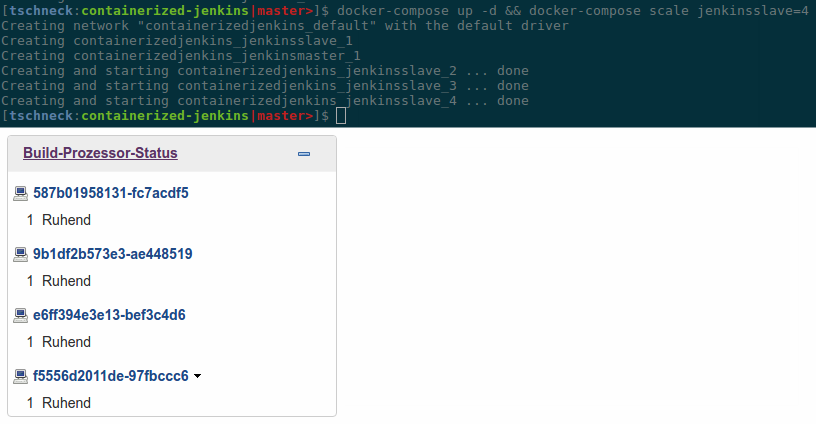

# Notes for build up docker-based Jenkins environment



## Build / Start / Shutdown

### automatic environment deployment

    ./update_envrionment.sh 

The automatic environment deploy script will do the following steps:
1) adds all modified files to git and commits it
2) pulls all changes from repo
3) rebuild all containers
4) stop and remove all running containers
5) start the new containers
6) push the changes to the git repo

### manual environment deployment

build and start the jenkinse master and slave container

    docker-compose build
    docker-compose up

e.g. scale our amount on slave to `4`:

    docker-compose scale jenkinsslave=4

(use for updates) shutdown and remove all started jenkins containers
    
    docker-compose down


# Clean up temporary data

__(optional)__ remove all _temporary data_ as logs and so on

    ./rm_temp_conf_files.sh 
    
# Server / Nodes
  
* Jenkins Build Server:  [localhost](http://localhost)
    * The admin user have the following credentials: `admin` / `admin`
  
## git clone
Use as template the following github repo:
  
    git clone git@github.com:toschneck/containerized-jenkins.git
    
## FOR PRODUCTION
__ATTENTION: make sure to change the default node password  keys under:__

* http://localhost/user/node/configure
* and in your `docker-compose.yml`
  ```
      environment:
        - JENKINS_JNLP_PW=change_this_password
  ```

